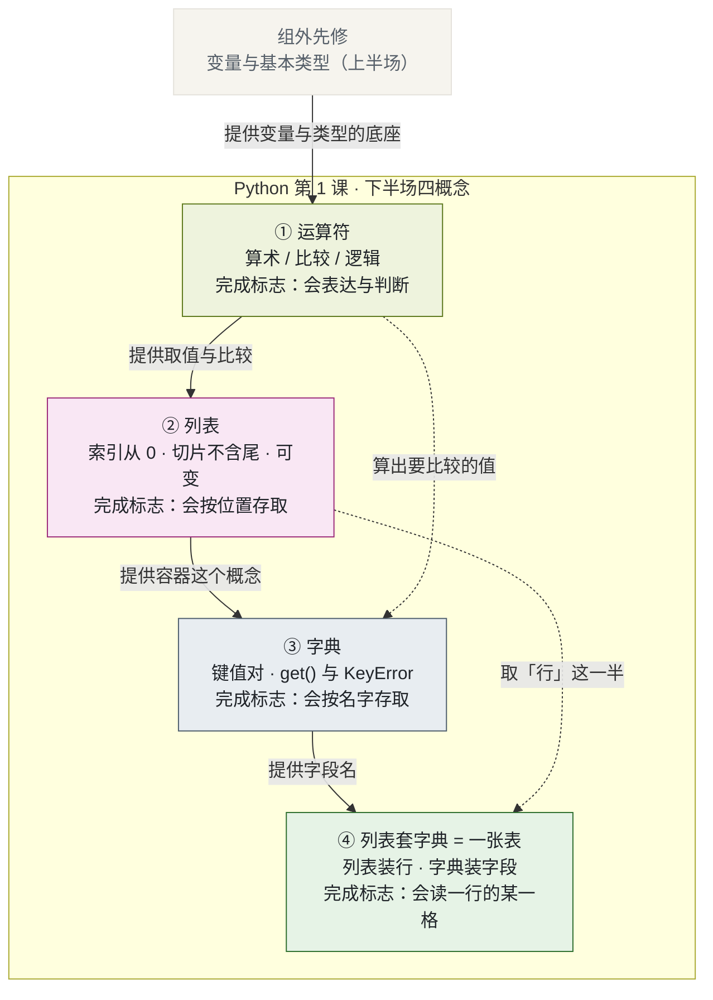
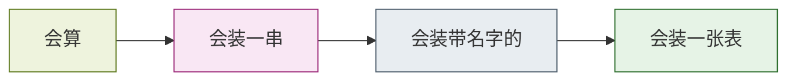

# Python 第 1 课 · 下半场四概念 的关系图

> 一份用 Mermaid 流程图 + 文字解析，把「运算符」「列表」「字典」「列表套字典（一张表）」四者联系起来的工作笔记。
> 配套学习资料：[运算符.html](../../Python基础语法课程/learning-materials/运算符.html)、[列表.html](../../Python基础语法课程/learning-materials/列表.html)、[字典.html](../../Python基础语法课程/learning-materials/字典.html)、[列表套字典.html](../../Python基础语法课程/learning-materials/列表套字典.html)
> 组索引页：[index.html](./index.html) ｜ 上一组：[Python 第 1 课 · 上手四概念](../python-lesson1-starter/关系图.md)
>
> **说明**：本图谱与仓库根目录的 [`concept-relationship.md`](../../concept-relationship.md)（AI Agent 领域）**分属不同知识网**，故独立成篇，不混入同一张图。两者仅以「相关图谱」互相指引。

---

## 一句话定位

> **运算符**给出**怎么算**，**列表**给出**怎么按顺序装一串**，**字典**给出**怎么按名字装一项**，**列表套字典**把前两者合起来，给出**真实数据长什么样** —— 四者构成「从单个值到一张表」的完整台阶。

它们不是四个平行的词条，而是**处理数据这条路上的四级台阶**：

| 概念 | 解决什么问题 | 在本组中的角色 |
|---|---|---|
| **运算符** | 拿值做什么 | 动词：后面三个概念都靠它来"动" |
| **列表** | 一串有先后的值放哪 | 第一个容器：按编号找 |
| **字典** | 一组有名字的值放哪 | 第二个容器：按名字找 |
| **列表套字典 = 一张表** | 很多条记录怎么放 | 那根线：把两个容器拼成真实数据的样子 |

---

## 关系总览

**读图要点：**

- **实线是硬先修**：不先会运算符，列表与字典里的取值比较就无从谈起；不先有列表（容器这个概念），字典就少了一块认知基石。
- **虚线是软依赖**：④ 的核心动作是 <em>rows[0]["name"]</em> —— 先用列表的本事取「行」，再用字典的本事取「字段」，两者缺一不可；运算符篇则负责把取出来的值拿去比较和计算。
- **组外先修**：本组第 ① 篇直接建在上半场「变量与基本类型」之上，不重复讲变量与类型；如果那一篇还没看，建议先补。

---

## 边界矩阵（谁讲什么）

| 可能重叠的点 | 涉及概念 | 归属裁决 |
|---|---|---|
| 成员运算 `in` 谁来讲 | 运算符 ↔ 列表 ↔ 字典 | **运算符**只讲算术 / 比较 / 逻辑三组，**不含 `in`**；`in` 归 **列表**（`x in [...]`）与 **字典**（`键 in {...}`）各自讲，字典篇必须写明"查的是**键**不是值" |
| `+` 施加在容器上 | 运算符 ↔ 列表 | **运算符**用数字与文本演示"同一符号两种含义"；**列表**只留一句"两个列表也能用 `+` 合并"，不展开 |
| `KeyError` / `IndexError` | 字典 / 列表 ↔ 组外「报错怎么读」 | **报错怎么读**讲逐行读法；字典 / 列表篇只说明"什么时候会抛、怎么避免" |
| 可变对象的引用共享 | 列表 ↔ 组外「变量与基本类型」 | 上半场已讲"名字指向值"；**列表**篇负责把它**落到可变对象上**（`b = a` 后 `a.append` 影响 `b`）；**字典**篇只提一句"字典同样可变" |
| "一条记录"到底用谁表示 | 列表 ↔ 字典 ↔ 列表套字典 | 单条记录用**字典**；多条记录用**列表套字典**；**列表**不承担"记录"职责 |
| `for` 遍历取整列 | 三篇 ↔ 后续课程 | 三者都**不展开**；只在代码块内以注释给"写法预览"，并标注属后续控制流课程 |
| 本组 HTML 与上半场四篇 | 本组 ↔ 上半场 | 上半场回答"程序怎么跑起来、怎么写第一行代码"；本组回答"数据怎么装起来" —— 同一门课的两个阶段，不重复 |

---

## 学习路径

| 顺序 | 概念 | 为什么排在这里 |
|---|---|---|
| 1 | 运算符 | 不依赖组内任何概念，且是后面三个"做事"的基础 |
| 2 | 列表 | 只需组外的「变量与基本类型」，是本组第一个也是最基础的容器 |
| 3 | 字典 | 需要先有"容器"这个概念，再理解"按名字而不是按编号找" |
| 4 | 列表套字典 = 一张表 | 需要同时懂列表与字典 —— 它是把前两者拼起来的那根线 |

---

## 与仓库其他资产的关系

| 资产 | 关系 |
|---|---|
| [上半场四概念关系图](../python-lesson1-starter/关系图.md) | **同一门课的前一阶段**：那份讲"程序怎么跑起来"，这份讲"数据怎么装起来" |
| [notebooks/](../../Python基础语法课程/notebooks/)（两份 .ipynb） | **可运行练习**，`02-第1课下半场-字符串与运算符.ipynb` 与本组 ① 主题相邻，可配合练习 |
| [concept-relationship.md](../../concept-relationship.md) | **另一领域**的图谱（AI Agent）；与本组仅互相指引，不合并 |
| LLM Wiki（`tools/llm-wiki-agent/wiki/`） | 该 Wiki 的收录范围是 AI / LLM 领域，本组为 Python 教学概念，**故未登记**，以免稀释其领域边界 |

---

## 一句话总结

> **运算符是动词，列表是按序号排的储物柜，字典是按名字查的通讯录，列表套字典则是把后两者叠起来的那张表。**
> 四者按序到位，学习者才能把一段程序从"会算一个数"推进到"能读一整张数据表"。
