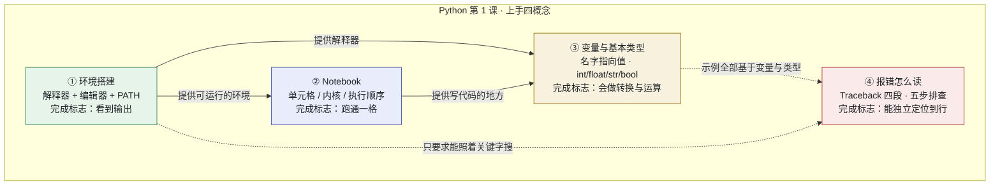
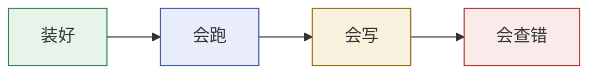

# Python 第 1 课 · 上手四概念 的关系图

> 一份用 Mermaid 流程图 + 文字解析，把「环境搭建」「Notebook」「变量与基本类型」「报错怎么读」四者联系起来的工作笔记。
> 配套学习资料：[环境搭建.html](../../Python基础语法课程/learning-materials/环境搭建.html)、[notebook.html](../../Python基础语法课程/learning-materials/notebook.html)、[变量与基本类型.html](../../Python基础语法课程/learning-materials/变量与基本类型.html)、[报错怎么读.html](../../Python基础语法课程/learning-materials/报错怎么读.html)
> 组索引页：[index.html](./index.html)
>
> **说明**：本图谱与仓库根目录的 [`concept-relationship.md`](../../concept-relationship.md)（AI Agent 领域）**分属不同知识网**，故独立成篇，不混入同一张图。两者仅以「相关图谱」互相指引。

---

## 一句话定位

> **环境搭建**给出**能跑**的机器，**Notebook**给出**在哪写**的载体，**变量与基本类型**给出**写什么**的积木，**报错怎么读**给出**写错了怎么办**的能力 —— 四者构成「第一次上手 Python」的完整闭环。

它们不是四个平行的词条，而是**同一个入门动作的四个先后侧面**：

| 概念 | 解决什么问题 | 在本组中的角色 |
|---|---|---|
| **环境搭建** | 程序在哪里跑得起来 | 地基：没有它后面三个都跑不起来 |
| **Notebook** | 代码写在哪、怎么执行 | 载体：第 1 课写代码的地方 |
| **变量与基本类型** | 第一块能自己拼的东西 | 积木：从「能跑」到「会算」 |
| **报错怎么读** | 出错了怎么自己修 | 贯穿始终的能力：前三个出问题时都靠它 |

---

## 关系总览

**读图要点：**

- **实线是硬先修**：没装好环境就开不了 Notebook；没有 Notebook 就没地方写变量。
- **虚线是软依赖**：报错篇的全部示例（TypeError 等）都建立在「变量与类型」之上，所以它排在最后；但它作为一种**能力**是贯穿始终的 —— 前三个概念出问题时，学员都在等它。
- **顺序上的代价**：把报错排在最后，意味着前两份材料里学员撞到报错时手上还没有解读工具。这是刻意取舍，若要「边学边能查错」，可把它提到 ③ 之前，届时示例依赖需重排。

---

## 边界矩阵（谁讲什么）

| 可能重叠的点 | 涉及概念 | 归属裁决 |
|---|---|---|
| `TypeError` 谁来讲 | 变量与基本类型 ↔ 报错怎么读 | **报错怎么读**完整讲排查；变量与基本类型只留一句「类型不匹配会抛 `TypeError`，读法见报错篇」 |
| 「跑通第一个程序」 | 环境搭建 ↔ 变量与基本类型 | 环境搭建的 hello world **只用** `print("...")`，不引入变量；变量与基本类型才引入赋值 |
| 「代码写在 Notebook 里」 | Notebook ↔ 变量与基本类型 | Notebook 只管「在哪写、怎么跑」；**代码内容本身**归变量与基本类型 |
| 报错输出显示的位置 | Notebook ↔ 报错怎么读 | Notebook 只讲「输出显示在单元格下方」；**输出内容什么意思**归报错怎么读 |
| 本组 HTML 与既有 Word 讲义 | 本组 ↔ 既有 docx | docx 定位**课堂讲义**（含教学法、练习）；本组 HTML 的报错篇定位**自学速查卡**，不复刻课堂练习 |

---

## 学习路径

| 顺序 | 概念 | 为什么排在这里 |
|---|---|---|
| 1 | 环境搭建 | 不依赖组内任何概念，且是其余三个的前提 |
| 2 | Notebook | 需要先装好环境，才能打开它 |
| 3 | 变量与基本类型 | 需要一个能跑代码的地方，且报错篇的示例依赖它 |
| 4 | 报错怎么读 | 需要先会写一点代码，才有东西可报错 |

---

## 与仓库其他资产的关系

| 资产 | 关系 |
|---|---|
| [notebooks/](../../Python基础语法课程/notebooks/)（两份 .ipynb） | **可运行练习**，与 ①②③ 一一对应，所有代码格已实跑核验 |
| [Python基础语法讲义（补充·报错怎么读）.docx](../../Python基础语法课程/) | 与 ④ 同主题、不同定位：**课堂讲义** vs **自学速查卡** |
| [concept-relationship.md](../../concept-relationship.md) | **另一领域**的图谱（AI Agent）；与本组仅互相指引，不合并 |
| LLM Wiki（`tools/llm-wiki-agent/wiki/`） | 该 Wiki 的收录范围是 AI / LLM 领域，本组为 Python 教学概念，**故未登记**，以免稀释其领域边界 |

---

## 一句话总结

> **环境搭建是机器，Notebook 是书桌，变量与类型是笔和字，报错怎么读是那位在你写错时告诉你「错在第几行」的老师。**
> 四者按序到位，学习者才能第一次独立地把一段程序从「写出来」推进到「跑得通」。
