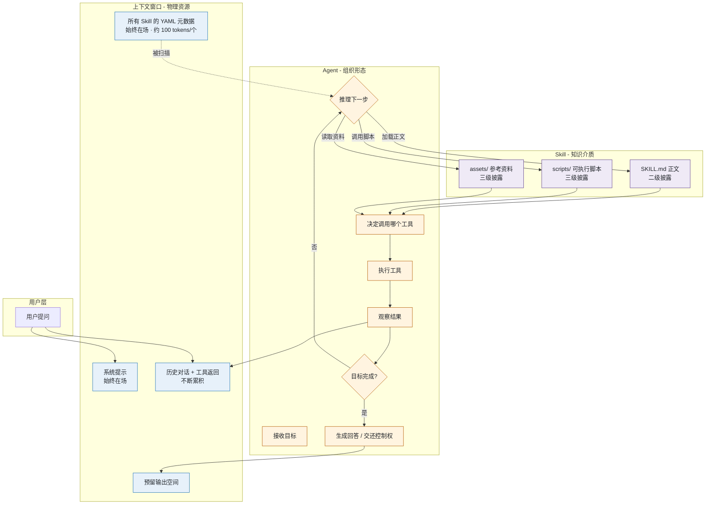
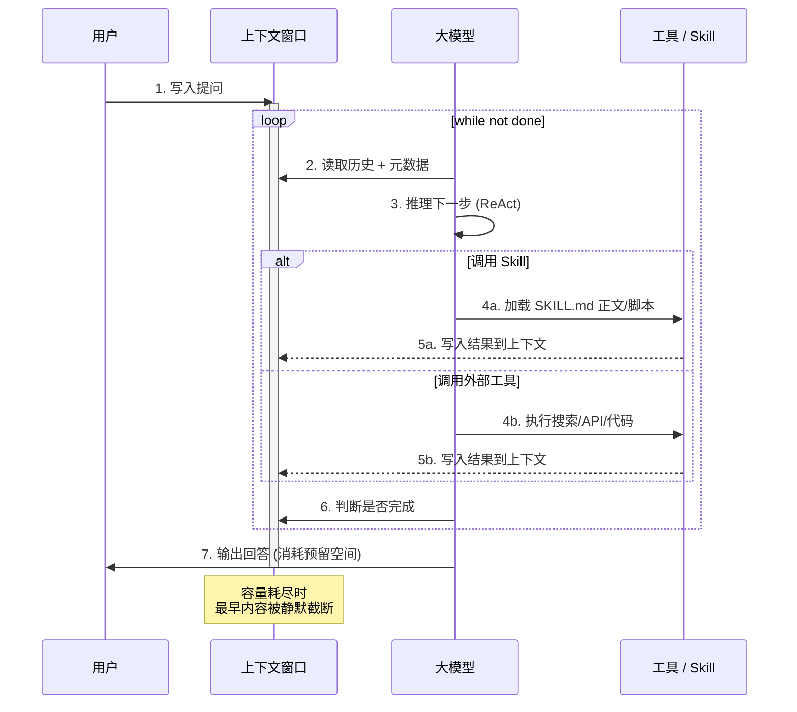
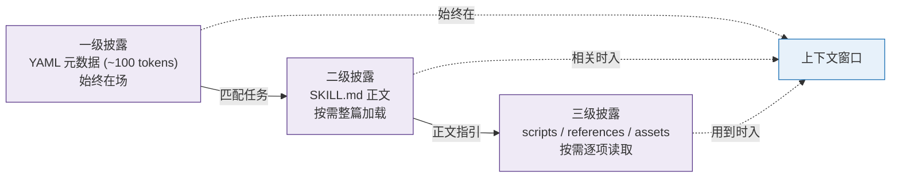
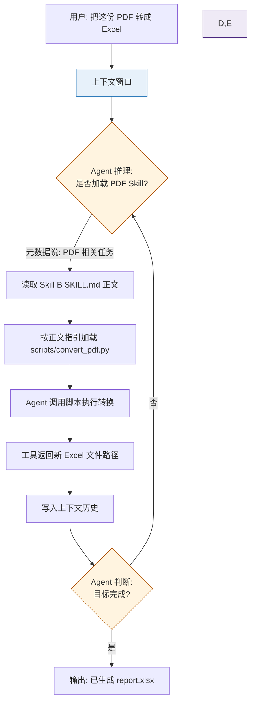

# Agent / 上下文窗口 / Skill 的关系图谱

> 一份用 Mermaid 流程图 + 文字解析，把「Agent」「上下文窗口」「Skill」三者联系起来的工作笔记。
> 配套学习资料：[agent.html](./learning-materials/agent.html)、[llm-context.html](./learning-materials/llm-context.html)、[skill.html](./learning-materials/skill.html)

---

## 一句话定位

> **Agent** 用 **Skill** 把专业知识按需装进 **上下文窗口**，三者共同构成一个「懂业务又能跑」的执行系统。

三者既不是平行概念，也不是上下级——它们是**同一个智能体工作流的三个侧面**：

| 概念 | 解决什么问题 | 在系统中扮演的角色 |
|---|---|---|
| **上下文窗口** | 模型这一轮「能看见什么」 | 物理资源：一张有限的桌子 |
| **Agent** | 谁来「决定下一步干什么」 | 组织形态：观察 → 推理 → 行动 的循环 |
| **Skill** | 模型如何「按规矩办事」 | 知识介质：渐进披露加载的经验目录 |

---

## 关系总览

下图展示了「用户提问」从进入到返回结果的全过程，三个概念在何处登场、各自负责什么：

---

## 关键循环：Agent × 上下文

把上图压缩成最有用的最小循环，看清楚两者的关系：

**这段循环里有一个隐藏张力：**
- 模型每一步都需要在上下文里「思考」——历史越丰富、决策质量越高。
- 但窗口是有限的，每一步的累积都在为下一步挤压空间。
- Agent 不能既「记得多」又「跑得久」，必须在二者之间走钢丝。

---

## Skill 如何帮 Agent 节约上下文

这是 Anthropic 工程博客里强调的「渐进式披露 (Progressive Disclosure)」：

**对比错误做法**：

| 做法 | 上下文代价 | 实际效果 |
|---|---|---|
| 把所有 Skill 正文常驻 | 假设 10 个 Skill × 2K tokens = 20K，永远占用 | 「全知道」幻觉，token 烧光 |
| 只放元数据 + 用时加载 | 每个常驻 100 tokens，需要时按需加载 | 「用到才加载」，动态控制成本 |

Skill 让 Agent 的「知识库」**理论上无限**、**实际上下文开销接近常数**。

---

## 三者为何不可替代

最容易混淆的边界：

| 想做的事 | 用 | 不该用 |
|---|---|---|
| 想要大模型这次能「看到」100 万字 | 扩大上下文窗口 | 写 Skill；Skill 不会改变窗口物理上限 |
| 想让模型按公司流程做事 | 写 Skill | 在系统提示里堆几千字；会被新会话忘掉 |
| 想要模型自己挑下一步该做啥 | 写 Agent 循环 | 用 Skill；Skill 不解决「下一步是什么」 |
| 想让模型直接操作浏览器 / 数据库 | 写 Agent + 调工具 | 只加大窗口；窗口只是「桌面」，不是「手」 |

**三者各管一摊：**
- **上下文窗口**管**「看得见什么」**（物理）
- **Skill** 管**「按什么规矩办事」**（知识）
- **Agent** 管**「下一步干什么」**（策略）

---

## 一个完整的最小例子

把三者合到一个具体场景里看：

**这个流程同时展示了：**
1. **上下文窗口**始终承担当前所有信息（用户问题、Skill 正文、工具结果、历史）的物理存储；
2. **Skill**贡献「怎么转换」的程序化知识和可执行代码；
3. **Agent**决定「什么时候加载 Skill」「什么时候调工具」「什么时候停」。

少任何一样，这个任务都会失败：
- 没有上下文窗口 → 模型失忆
- 没有 Skill → 模型不知道有 convert_pdf.py 可用
- 没有 Agent → 没人决定第一步是读 Skill 还是直接猜答案

---

## 一句话总结

> **上下文是桌面，Skill 是文件夹，Agent 是坐在桌前、按文件夹做事的人。**
> 三者各司其职，组合起来才是一个真正能干活、不会失忆、又守规矩的智能体。
