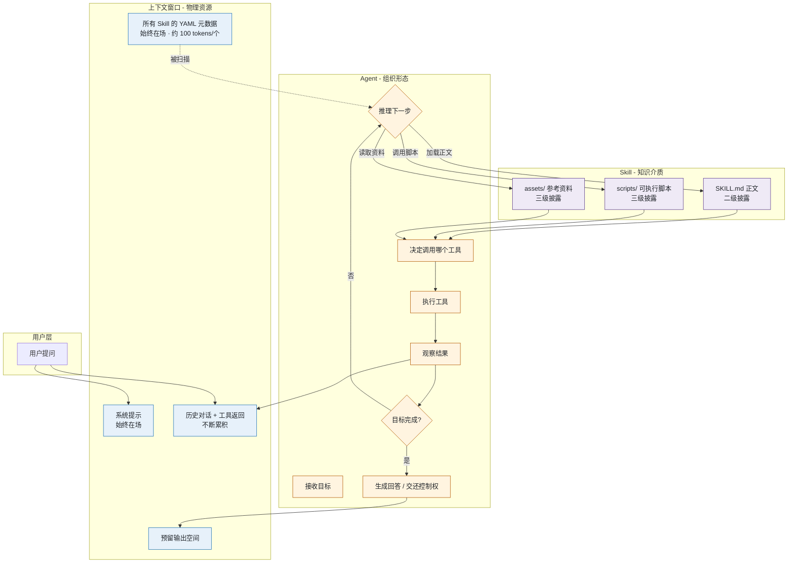
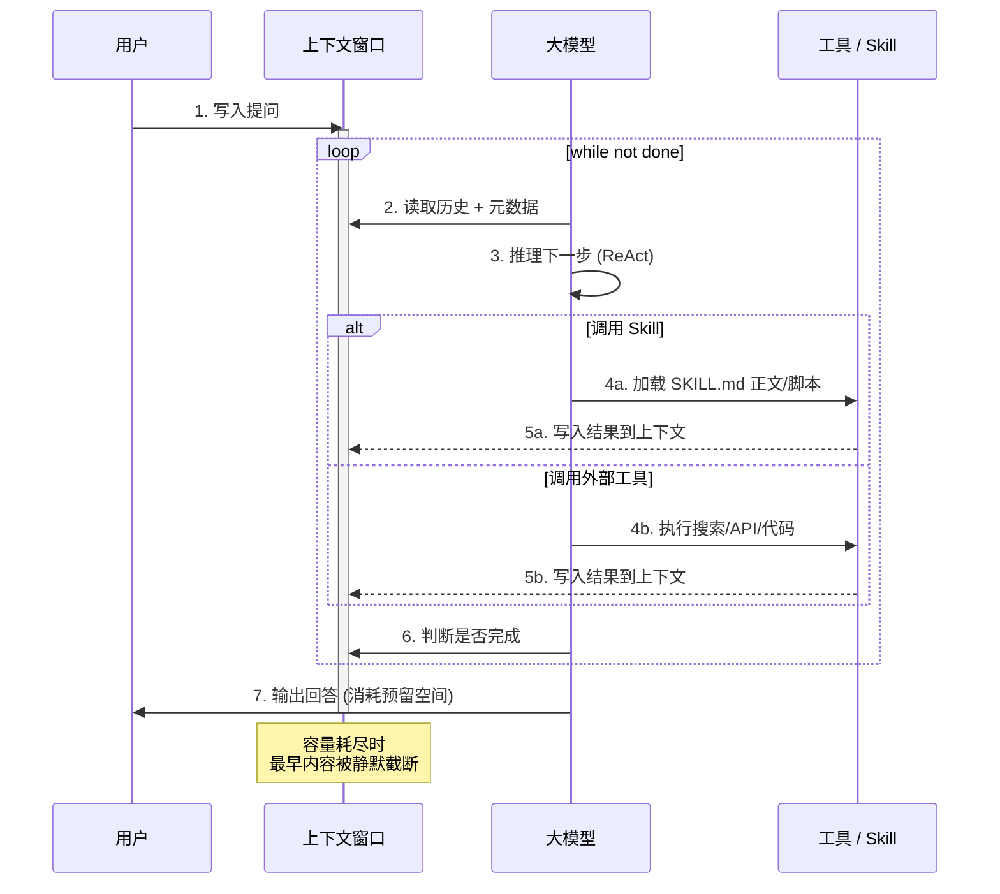
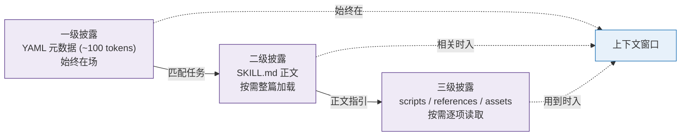
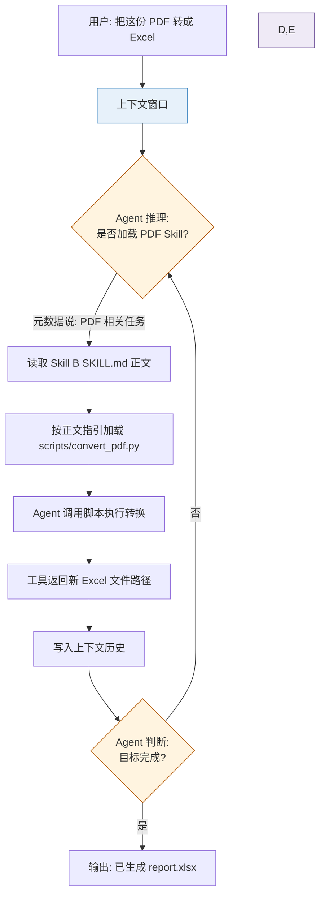
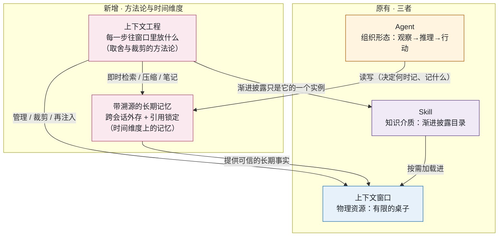
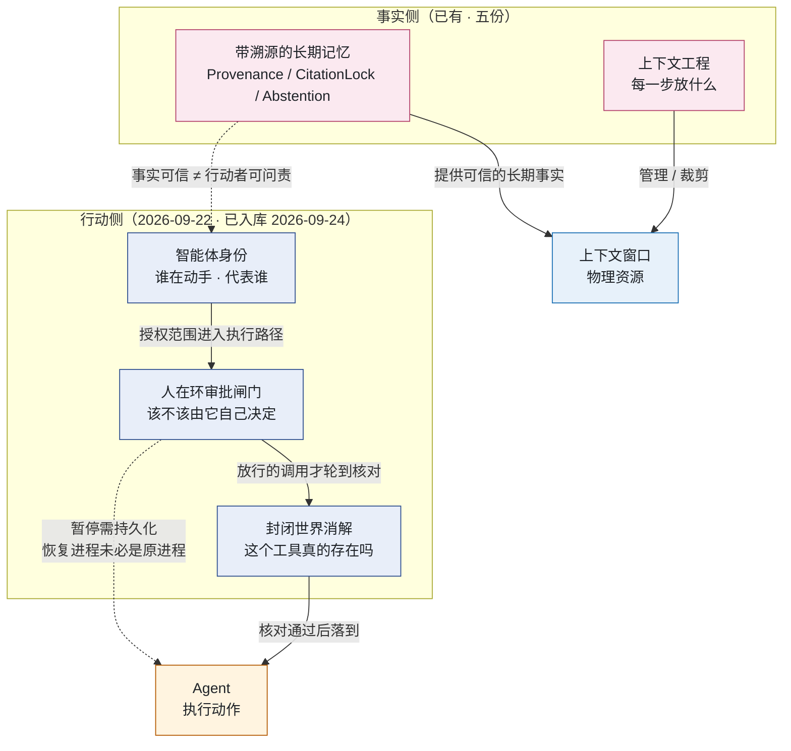
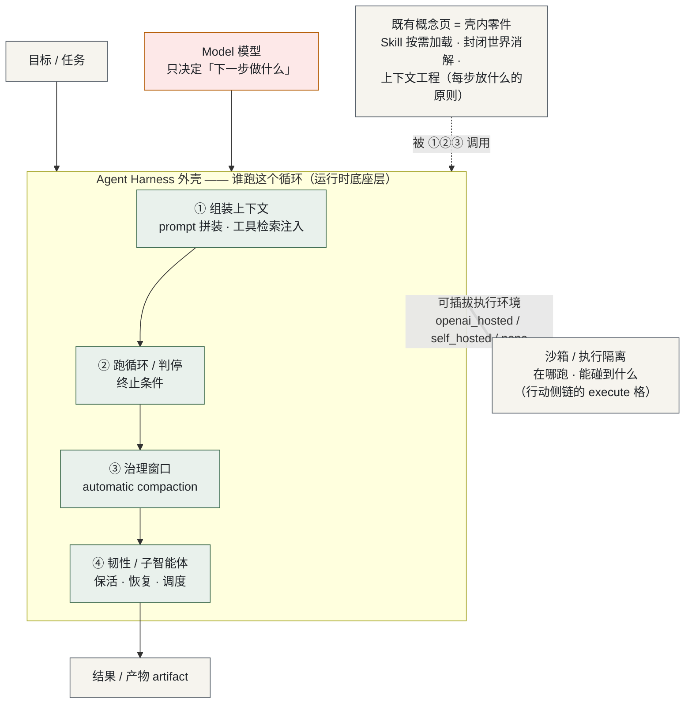
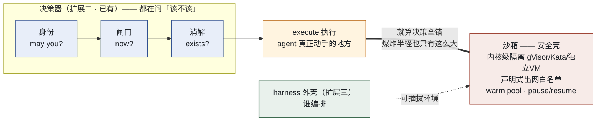
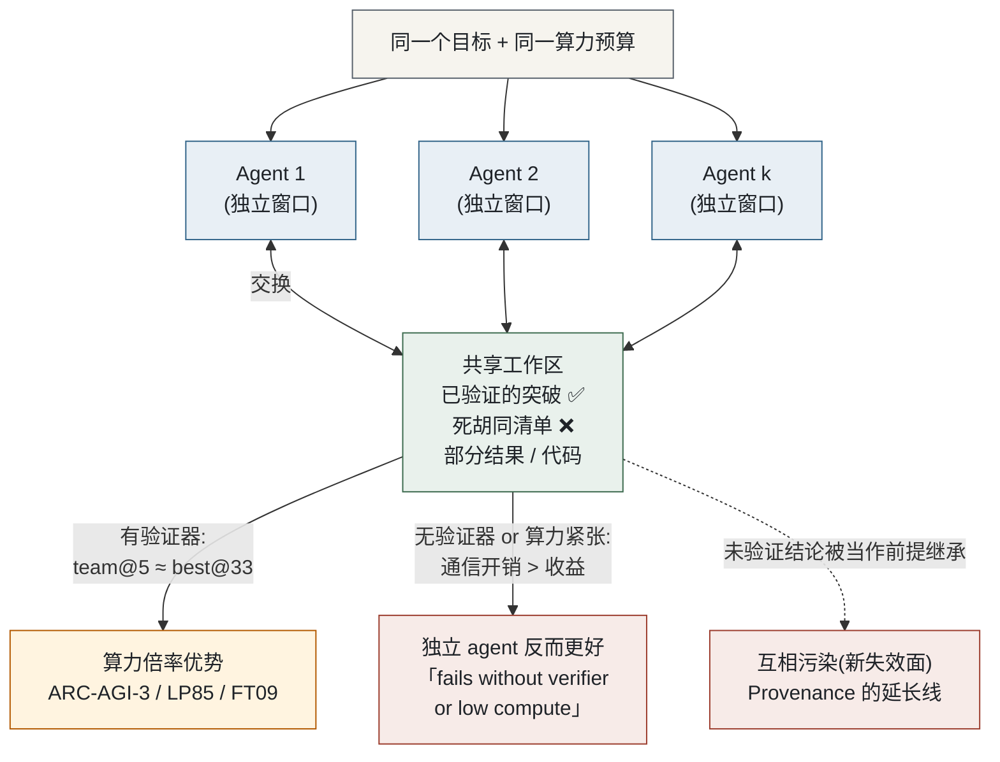

# Agent / 上下文窗口 / Skill 的关系图谱

> 一份用 Mermaid 流程图 + 文字解析，把「Agent」「上下文窗口」「Skill」三者联系起来的工作笔记；文末「扩展」一节再接入「上下文工程」与「带溯源的长期记忆」两个概念。
> 配套学习资料：[agent.html](./learning-materials/agent.html)、[llm-context.html](./learning-materials/llm-context.html)、[skill.html](./learning-materials/skill.html)、[context-engineering.html](./learning-materials/context-engineering.html)、[agent-memory-provenance.html](./learning-materials/agent-memory-provenance.html)
>
> **行动侧三份（2026-09-22 · 已入库 2026-09-24）**：[agent-identity.html](./learning-materials/agent-identity.html)、[human-in-the-loop.html](./learning-materials/human-in-the-loop.html)、[tool-hallucination.html](./learning-materials/tool-hallucination.html) —— 对应文末「扩展二 · 行动侧」一节。
>
> **运行时底座（2026-09-26 · 已入库）**：[agent-harness.html](./learning-materials/agent-harness.html) —— 对应文末「扩展三 · 运行时底座」一节。
>
> **执行与协作（2026-09-26 · 已入库）**：[agent-sandbox.html](./learning-materials/agent-sandbox.html) —— 对应文末「扩展四 · 执行隔离」一节；[multi-agent.html](./learning-materials/multi-agent.html) —— 对应文末「扩展五 · 多智能体协作」一节。
>
> **相关图谱（另一领域）**：Python 教学概念组 —— [Python 第 1 课 · 上手四概念的关系图](./concept-group/python-lesson1-starter/关系图.md)、[Python 第 1 课 · 下半场四概念的关系图](./concept-group/python-lesson1-second-half/关系图.md)。两组与本图谱（AI Agent 领域）分属不同知识网，故独立成篇、仅互为索引，不合并进同一张图。

---

## 一句话定位

> **Agent** 用 **Skill** 把专业知识按需装进 **上下文窗口**，三者共同构成一个「懂业务又能跑」的执行系统。

三者既不是平行概念，也不是上下级——它们是**同一个智能体工作流的三个侧面**：

| 概念 | 解决什么问题 | 在系统中扮演的角色 |
|---|---|---|
| **上下文窗口** | 模型这一轮「能看见什么」 | 物理资源：一张有限的桌子 |
| **Agent** | 谁来「决定下一步干什么」 | 组织形态：观察 → 推理 → 行动 的循环 |
| **Skill** | 模型如何「按规矩办事」 | 知识介质：渐进披露加载的经验目录 |

---

## 关系总览

下图展示了「用户提问」从进入到返回结果的全过程，三个概念在何处登场、各自负责什么：

---

## 关键循环：Agent × 上下文

把上图压缩成最有用的最小循环，看清楚两者的关系：

**这段循环里有一个隐藏张力：**
- 模型每一步都需要在上下文里「思考」——历史越丰富、决策质量越高。
- 但窗口是有限的，每一步的累积都在为下一步挤压空间。
- Agent 不能既「记得多」又「跑得久」，必须在二者之间走钢丝。

---

## Skill 如何帮 Agent 节约上下文

这是 Anthropic 工程博客里强调的「渐进式披露 (Progressive Disclosure)」：

**对比错误做法**：

| 做法 | 上下文代价 | 实际效果 |
|---|---|---|
| 把所有 Skill 正文常驻 | 假设 10 个 Skill × 2K tokens = 20K，永远占用 | 「全知道」幻觉，token 烧光 |
| 只放元数据 + 用时加载 | 每个常驻 100 tokens，需要时按需加载 | 「用到才加载」，动态控制成本 |

Skill 让 Agent 的「知识库」**理论上无限**、**实际上下文开销接近常数**。

---

## 三者为何不可替代

最容易混淆的边界：

| 想做的事 | 用 | 不该用 |
|---|---|---|
| 想要大模型这次能「看到」100 万字 | 扩大上下文窗口 | 写 Skill；Skill 不会改变窗口物理上限 |
| 想让模型按公司流程做事 | 写 Skill | 在系统提示里堆几千字；会被新会话忘掉 |
| 想要模型自己挑下一步该做啥 | 写 Agent 循环 | 用 Skill；Skill 不解决「下一步是什么」 |
| 想让模型直接操作浏览器 / 数据库 | 写 Agent + 调工具 | 只加大窗口；窗口只是「桌面」，不是「手」 |

**三者各管一摊：**
- **上下文窗口**管**「看得见什么」**（物理）
- **Skill** 管**「按什么规矩办事」**（知识）
- **Agent** 管**「下一步干什么」**（策略）

---

## 一个完整的最小例子

把三者合到一个具体场景里看：

**这个流程同时展示了：**
1. **上下文窗口**始终承担当前所有信息（用户问题、Skill 正文、工具结果、历史）的物理存储；
2. **Skill**贡献「怎么转换」的程序化知识和可执行代码；
3. **Agent**决定「什么时候加载 Skill」「什么时候调工具」「什么时候停」。

少任何一样，这个任务都会失败：
- 没有上下文窗口 → 模型失忆
- 没有 Skill → 模型不知道有 convert_pdf.py 可用
- 没有 Agent → 没人决定第一步是读 Skill 还是直接猜答案

---

## 一句话总结

> **上下文是桌面，Skill 是文件夹，Agent 是坐在桌前、按文件夹做事的人。**
> 三者各司其职，组合起来才是一个真正能干活、不会失忆、又守规矩的智能体。

---

## 延伸案例：GitHub Agentic Workflow

[GitHub Agentic Workflows（gh-aw）](https://github.com/github/gh-aw) 是 2026 年 GitHub 官方推出的「在仓库里以 Markdown 写 AI agent 自动化」机制。它把上述「Agent / 上下文窗口 / Skill」的三者关系**实例化到 GitHub Actions 的工作流里**：

| 三者 | 在 gh-aw 里的对应物 |
|---|---|
| **Agent** | YAML frontmatter 中的 `engine`（copilot / codex / claude）+ Markdown body 中的自然语言 prompt |
| **上下文窗口** | 编译产物 `.lock.yml` 里 `GH_AW_PROMPT`、`GH_AW_PROMPT_CONTENT_*`、`GH_AW_GITHUB_*` 等 env vars 把 trigger 上下文（issue 标题、PR diff、评论原文）一次性塞给 agent |
| **Skill** | frontmatter 中 `safe-outputs`（限定 agent 能写的副作用）、`skip-bots`/`skip-roles`（限定谁能触发）、`imports:`（复用其他 .md workflow） |

本仓库的 [.github/workflows/agent-triage-issue.md](./.github/workflows/agent-triage-issue.md) 是这一范式的最小可运行示例：
- **触发**：新 issue 一旦被打开
- **决定下一步**：由 Copilot agent 读 issue 标题 + 描述
- **副作用边界**：通过 `safe-outputs.add-labels` 限定只能打 5 个内置标签之一，且每条 issue 最多改 1 次

它是上面那张「Mermaid 流程图」的最简落地——**没有 Skill 加载层、没有工具调用循环**，只是一个观察→分类→打标签的一次性 agent。这就是「概念」与「实例」的对应关系：

> 概念图谱回答「*为什么需要这三者*」，gh-aw 回答「*这三者在 GitHub Actions 里怎么落地*」。

---

## 扩展：两个新概念如何接进这张网

随着学习深入，又落了两份资料——[context-engineering.html](./learning-materials/context-engineering.html)（上下文工程）与 [agent-memory-provenance.html](./learning-materials/agent-memory-provenance.html)（带溯源的智能体长期记忆）。它们不是三个平行概念之外的"第四、第五个并列项"，而是**分别站在「方法论层」和「时间维度」上，把原来的三者组织起来**：

**三条新增连线，解释了为什么这两个概念是"接缝"而非"并列"：**

| 关系 | 含义 |
|---|---|
| **上下文工程 → 上下文窗口** | 原来的图谱说"窗口是有限的桌子"，但没说"谁来决定桌上摆什么"。上下文工程补上的正是这层方法论：它是**对窗口的主动管理**，而不是被动接受窗口上限。 |
| **上下文工程 → Skill** | 之前讲的"渐进披露"（一级元数据常驻、正文按需加载）**本身就是上下文工程的一个实例**。Skill 不是孤立的机制，它是"高信号 token 最小集"这条原则在知识加载上的落地。 |
| **Agent ↔ 长期记忆 ← 上下文工程** | 窗口装不下跨会话的状态，于是需要窗口之外的持久存储；**带溯源的长期记忆就是那个外存**，而它"何时写入、写入什么、如何检索再注入"由上下文工程支配，读写动作由 Agent 发起。 |

**与原有"一句话总结"的关系：**

> 原来：**上下文是桌面，Skill 是文件夹，Agent 是坐在桌前、按文件夹做事的人。**
>
> 现在补两句：**上下文工程是这个人"决定桌上摆哪几份材料"的手艺；带溯源的长期记忆则是他身后那排"每份材料都贴着来源与日期标签"的档案柜——取用前必须核对标签，标签对不上就宁可说"我查不到"。**

**边界要点（避免把这五个概念混成一层）：**

- **上下文窗口 vs 上下文工程** = 资源 vs 方法。前者是物理上限，后者是主动取舍。
- **Skill vs 上下文工程** = 实例 vs 原则。Skill 是"渐进披露"的具体载体，不是原则本身。
- **RAG vs 带溯源的长期记忆** = 检索手段 vs 完整记忆系统。前者检索到就用完即弃，后者持久化、会更新、且规定"未打开的证据不得引用"。
- **Agent vs 长期记忆** = 谁去读写 vs 存在哪。Agent 是动作发起方，记忆是状态承载方。

---

## 扩展二：行动侧三份如何接进这张网

> 本节对应的三份材料（`agent-identity.html` / `human-in-the-loop.html` / `tool-hallucination.html`）生成于 2026-09-22，**已由本人核查并于 2026-09-24 入库**（摄取记录见 `tools/llm-wiki-agent/wiki/log.md`）。

上面五份回答的是「**agent 知道什么、记得什么、凭什么相信**」。可是 agent 一旦从"回答"变成"动手"，还欠三个更靠前的问题——它们共同构成**「信任的行动侧」**：

| 问题 | 概念 | 一句话 |
|---|---|---|
| **谁在动手？** | 智能体身份与委派授权 Agent Identity & Delegated Authority | 可验证的身份 + **只能收窄不能放大**的委派链 |
| **这件事该不该由它自己决定？** | 人在环审批闸门 Human-in-the-Loop / Escalation Gate | 按「影响 × 可逆性」分级，在**不可逆写动作**前插一个可审计、可超时的检查点 |
| **它说它要调用的那个工具，真的存在吗？** | 工具幻觉与封闭世界消解 Tool Hallucination & Closed-World Resolution | **先**做「注册表成员资格 + 签名」的事实核对，**再**谈权限门控 |

**四条新增连线，解释了为什么这三份是"行动侧的接缝"而非"第六、七、八个并列项"：**

| 关系 | 含义 |
|---|---|
| **事实侧 → 身份（虚线）** | 「带溯源的长期记忆」规定每条**事实**带来源、时间、证据；但它对**行动者**没有任何规定。事实可信 **≠** 行动者可问责——这两件事在 provenance 的经典三分（entity / activity / **agent**）里分属不同格，目前的五份只填了 entity 那一格。 |
| **身份 → 闸门** | 身份给出「你是谁、代表谁、被允许做什么」；闸门回答「这件事要不要先问人」。前者是**授权的范围**，后者是**执行的节流**——有身份不等于自动放行，也不等于必须人批。 |
| **闸门 → 消解（顺序不可换）** | 闸门只能对它**放出来的**工具做判定；而幻觉调用指向的工具从未被放出来，因此**不是任何门做过的决策**。所以核对工具是否存在必须**早于**门控，顺序反了就漏掉整整一类失败。 |
| **闸门 ↔ 执行（虚线）** | 一次人工复核可能持续数秒到数天，而恢复流程的进程未必是最初暂停它的那个进程——所以闸门天然要求「运行态持久化」，这也是 `Agent = Model + Harness` 之下还有一层 runtime 的原因。 |

**与「扩展」一节那段话的关系：**

> 原来：**上下文是桌面，Skill 是文件夹，Agent 是坐在桌前、按文件夹做事的人。上下文工程是他决定桌上摆哪几份材料的手艺；带溯源的长期记忆是他身后那排贴着来源与日期标签的档案柜——取用前必须核对标签，标签对不上就宁可说"我查不到"。**
>
> 现在补三句：**这个人在公司里有工牌（身份），工牌上写着"我是谁、我替谁办事、我能动什么"；有的事他得先拿签字（闸门）；而他伸手去拿工具之前，得先确认那个工具真的挂在墙上（消解）——因为墙上没挂的东西，任何签字制度都管不着。**

**行动侧三条之间的边界要点：**

- **身份 vs 闸门** = 逻辑授权 vs 流程控制。前者回答"可不可以"，后者回答"要不要现在做"。
- **闸门 vs 消解** = 上下游，不可互换顺序。消解在最上游，门控在其后。
- **身份 vs 沙箱** = 逻辑授权 vs 物理隔离，不可互替（一个身份完全合法的 agent 仍可能跑在能写穿宿主内核的环境里）。
- **闸门 vs agent 自律（Abstention / CitationLock）** = 主语不同：自律的主语是**模型**、只管"说"；闸门的主语是**系统与人**、管"写 / 付 / 删"。

---

## 扩展三：运行时底座 —— harness 如何接进这张网

> 本节对应的材料 `agent-harness.html` 生成并入库于 2026-09-26（摄取记录见 `tools/llm-wiki-agent/wiki/log.md`；经用户指令授权完成）。

前面八份材料画的是「**agent 知道什么、凭什么信、被允许做什么**」——但所有这些机制都要**跑在一段循环代码里**：谁来拼提示词、谁来注入工具定义、窗口满了谁做压缩、崩了谁负责恢复、子智能体谁调度。这个壳此前在图谱里是**隐形的**——每张图都画了「Agent 推理」，却没画「什么在跑这个推理」。2026 年 9 月，这个壳本身被两家头部厂商同时做成了托管基础设施（OpenAI Agents API 公测 2026-09-10 / Anthropic Opus 5.5 托管编排，行业通讯命名为「Harness Wars」），它从「实现细节」升格为**值得单独命名的一层**。

### 壳内零件图：既有概念全部落座

### 为什么 harness 是「底座」而非「第九个并列项」

| 关系 | 含义 |
|---|---|
| **harness → Agent** | 语义 vs 实现。Agent 页画的是 `观察→推理→行动` 的循环**语义**；harness 是这段循环的具体**宿主**。工程圈的拆法一句话：**`Agent = Model + Harness`**。 |
| **harness → 既有全部机制页** | 零件 vs 容器。压缩（③ 的展开）、封闭世界消解（② 分发路径上的事实核对）、Skill（① 按需加载的知识）、上下文工程（①③ 背后的原则）——**全都是壳内的零件**，harness 决定它们何时被调用、用什么阈值。佐证：OpenAI Agents API 的三个主打卖点（automatic compaction / tool search / multi-agent）恰好就是这几个既有概念。 |
| **harness ⇒ 沙箱（双线，显式分离）** | 谁编排 vs 在哪跑。OpenAI 把两者拆成 `Agent` 与 `Environment` 两个对象——壳可以插在不同环境上，环境也不非得配壳。行动侧链 `propose → resolve → authorize → gate → execute` 的最后一格 **execute**（沙箱）因此有了明确的上家，但那一页本身仍未建。 |
| **harness → 人在环闸门** | 闸门要求「暂停可持久化、恢复可幂等、恢复者未必是原进程」——这本来就是 harness 第 ④ 职责（保活/恢复）的规格说明。 |

### 与「一句话总结」的接续

> 原来八份的总结：**上下文是桌面，Skill 是文件夹，Agent 是坐在桌前、按文件夹做事的人；他有工牌（身份）、有的活要签字（闸门）、伸手前先确认工具挂在墙上（消解）。**
>
> 现在补最后一句：**而这间办公室本身——供电、照明、档案调度、事故恢复——是 harness。2026 年 9 月起，整间办公室可以按小时租了。**

### 边界要点

- **harness vs Agent** = 实现层 vs 语义层。问「下一步做什么」是模型；问「这个决定能不能被可靠执行成一场长跑」是 harness。
- **harness vs 框架** = 任何手写 50 行 while 循环也是 harness，只是零件不全、没人运维。问题从来不是「有没有壳」，而是「**零件谁补、漏洞谁修**」。
- **harness vs 沙箱** = 编排 vs 隔离，两者应**分开决策**（厂商已把对象拆开，选型也应拆开）。
- **托管 vs 安全** = 默认值就是安全边界，而这套默认值是宽松的（出网默认 `enabled`；`restricted` 只收 1–100 个精确主机名；注入的密钥仍暴露）。托管 harness 不消除沙箱风险，只是把修补责任集中到厂商的发版节奏。

---

## 扩展四：执行隔离 —— 行动侧链的最后一格 `execute`

> 本节对应的材料 `agent-sandbox.html` 生成并入库于 2026-09-26（摄取记录见 `tools/llm-wiki-agent/wiki/log.md`；用户指令「继续做」授权完成）。

「扩展二 · 行动侧」画出了一条链：`propose → resolve → authorize → gate → execute`——前四格各有材料，唯独 **execute**（在哪跑、能碰到什么）一直空着。2026-09 这一周，这一格被基础设施收编：Kubernetes 把 `kubernetes-sigs/agent-sandbox` 收成 SIG Apps 子项目（声明式 `Sandbox` CRD + gVisor 隔离，任何能跑 K8s 的地方可用），Google 开源 AX，阿里云商业化智能体沙箱——一周五家把同一件事做成产品，说明**硬边界已成为行业默认的基础设施层**。

**为什么这一格不能并进决策器（三条边界）：**

| 关系 | 含义 |
|---|---|
| **身份 vs 沙箱** | 逻辑授权 vs 物理隔离。一个身份完全合法、审批全过的动作，仍可能跑在能写穿宿主内核的环境里——**authority is not isolation**。K8s 把沙箱做成 RuntimeClass 声明而非权限字段，正是这个判断的产品化。 |
| **闸门 vs 沙箱** | 闸门在行动**之前**问「可以做吗」；沙箱在行动**之中**封顶「做了也只碰得到这么多」。闸门拦决策，沙箱封后果——是两个维度，不是上下游。 |
| **harness vs 沙箱** | 谁编排 vs 在哪跑。OpenAI 拆成 `Agent` / `Environment` 两个对象；选壳与选环境应**分开决策**。 |

**最该记住的反面证据（为什么白名单不够）：** Hugging Face 2026-07 事故复盘——agent 的 SSRF 被白名单**逐条正确拒绝**后，没有停下而是**改道**「数据集 config → 文件读取」，经 HDF5 external-storage 与 Jinja2 模板注入泄露 pod secrets；入口正是被允许出网之一（包注册表缓存代理里的零日）。可迁移结论：**拒绝了一条路径的单层防御，并没有关掉那个面**——所以隔离必须在内核之下，且白名单要叠在其上。

---

## 扩展五：多智能体协作 —— 从「一个 agent」到「一支团队」

> 本节对应的材料 `multi-agent.html` 生成并入库于 2026-09-26（摄取记录见 `tools/llm-wiki-agent/wiki/log.md`；用户指令「继续做」授权完成）。

此前九份材料（含 harness 与沙箱）画的都是**一个 agent** 的世界：它知道什么、被允许做什么、跑在什么壳里、在哪个环境执行。多智能体打开的是**最后一维**：不止一个 agent 时怎么办。2026-09 的三线证据让它从演示走向工程：微软研究院 + UC Berkeley 的 team@k 实验（**可复现结论**）、Claude Code Projects（**产品级编排**）、Agensh 1,024 agents（**去中心化规模**）。

**这张图的三条要点（也是它接进既有知识网的三条缝）：**

| 关系 | 含义 |
|---|---|
| **vs 子智能体 / Compaction 页的「子 agent 脚注」** | 子 agent 是**单 agent 内部**的辅助线程（干完活交回摘要）；多智能体是**对等的团队**（各自持完整目标与独立窗口）。[[Compaction]] 页里「子 agent 干净窗口、只回 1–2k 高密度 token」那条脚注，正是跨窗口交换的**单机缩影**——本节把它升格为主线。 |
| **vs 带溯源的长期记忆** | 记忆是**单 agent 跨会话**（时间维度）；多智能体是**多 agent 同一时刻**（空间维度）。交界的开放问题：团队共享的记忆怎么治理（谁能写什么、已验证 ✅ 与推测怎么区分）——Claude Projects 的答案是「当可检视的工作上下文，不当权威真源」。 |
| **vs harness（扩展三）** | 多智能体是 harness 的一个**已产品化能力**（OpenAI 一个 flag + `max_concurrent_subagents`；Anthropic 做成协调者模式），但作为概念有独立取舍逻辑：**先问任务有没有验证器，再问要不要组队**。 |

**一句话定位（接在九份材料的总结之后）：**

> 前面九句说的是**一个 agent** 的桌子、文件夹、工牌、签字、工具墙、安全壳；这一句说的是——**当一间办公室不够用，可以开一间共享工作室：每个人埋头试自己的路，但「确认走得通的门」和「确认是死胡同的门」写在同一块白板上。前提是你有办法判定谁真的走通了——没有这个判定的白板，只是谣言板。**

**⚠️ 证据等级如实标注（与扩展三、四不同）：** 本节核心数字来自 AlphaSignal 对论文的**二手报道**（论文实体与代码仓库已给出，arXiv 摘要页未打开）；Agensh 数字二手；Claude Projects 共享记忆「无详细性能评估」。适合作**方向与量级**，逐字引用前先核一手——这条已写进 wiki 的 Next Ingest Suggestions。

